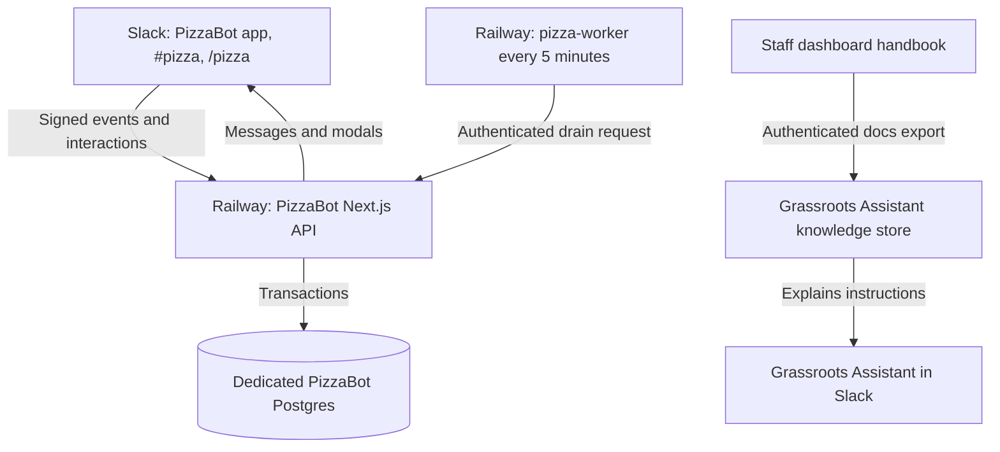

# PizzaBot technical architecture

Last documented: 8 October 2026. This document describes the deployed design; [the plain-English guide](how-it-works.md) explains staff use. [README](../README.md) contains the full operational policy and recovery procedure.

## Boundaries and ownership

PizzaBot is a standalone Next.js 16 API application on Node.js 22 with a dedicated PostgreSQL database. Its MIT-licensed source repository is [awpthorp/pizzabot](https://github.com/awpthorp/pizzabot). Staff use Slack commands, Block Kit messages and modals. There is no PizzaBot website or dashboard frontend, and no LLM dependency.

The `grassroots` repository serves `dash.gr.agency` and its staff handbook. The `gr-agency-clients` repository runs Grassroots Assistant / Brain. Neither stores PizzaBot's ledger or has a PizzaBot database connection. The connection is documentation: the staff docs export feeds the Brain's existing handbook ingestion.

There is deliberately no connection from the handbook or Brain to PizzaBot accounting. The handbook describes defaults; admins can change live values, so current balances, catalogue and settings must come from `/pizza`.

## Deployed services and request paths

The PizzaBot Railway project contains three services. The web and scheduled worker build from the same repository's `main` branch.

| Service | Responsibility | Build / start |
| --- | --- | --- |
| `pizzabot` | Signed Slack endpoints, transactions, scheduling and delivery | `Dockerfile`, `node server.js`; pre-deploy `npm run migrate` |
| `pizza-worker` | Recover queued work and check report deadlines | `Dockerfile.worker`, `node scripts/run-pizza-worker.mjs`; cron `*/5 * * * *`, restart NEVER |
| Postgres | Dedicated durable data store | Managed Railway PostgreSQL |

Set your own HTTPS web origin when deploying. The manifest uses `https://pizzabot.example.com` placeholders; replace them before installation.

| Endpoint | Caller / purpose |
| --- | --- |
| `/api/slack/pizza/events` | Slack signature verification, URL challenge and recognition events |
| `/api/slack/pizza/commands` | Signed `/pizza` commands |
| `/api/slack/pizza/interactions` | Signed buttons and modal actions |
| `/api/slack/pizza/drain` | Bearer-authenticated worker trigger |
| `/api/health` | Lightweight Railway readiness check |

Slack uses the separate PizzaBot app configured in `slack/pizza-manifest.json`. When moving the web origin, change events, commands and interactivity URLs together. Do not change the Assistant's app or endpoints.

## Recognition flow

1. Slack sends the original message. The API verifies the raw-body signature and workspace/app, checks the recognition channel and message shape, then persists work before acknowledging within Slack's three-second deadline. A persistence failure produces a retryable response. Member eligibility is checked during processing before an award can commit.
2. Next.js `after()` normally drains promptly. The five-minute worker recovers work after deployment, process loss or a temporary outage. In-memory state is never authoritative.
3. The worker parses direct mentions and pizza count, checks members and applies policy. Original Slack timestamps determine Dubai daily allowance and leaderboard periods.
4. One transaction locks affected accounts in deterministic order and applies allowance, allocations, available/earned balances, ledger records and notification jobs. Stable event/message keys prevent repeat accounting.
5. Slack delivery occurs outside database locks. The outbox records delivery status separately from accepted accounting.

## Public leaderboard sharing

Normal slash command replies are private. Only `leaderboard share` (with optional period and received/given view) queues a public standings message. The worker checks staff eligibility, requires the invoking channel to match the configured recognition channel, and validates it is public, internal, unshared and available to the bot.

`shareLeaderboard` atomically queues a bounded top-ten snapshot with a `leaderboard-share:<job ID>` deduplication key, a private receipt, and job completion under the existing inbox lease. It does not mutate accounts, allowance, ledger, goals or reports. Delivery revalidates the configured channel and uses the existing outbox retry and ambiguous-delivery reconciliation. The receipt says queued because the public Slack delivery happens separately.

## Reward and admin flows

A redemption uses a persisted confirmation intent bound to the user and displayed price. On submission, the backend rechecks current eligibility, price and stock. A single transaction debits the account, consumes stock, creates the request and queues notifications. A changed price requires a new confirmation.

Requests snapshot the reward name and cost. Fulfilment records completion; cancellation of a pending request refunds once. Account locks serialize redemptions, refunds and corrections. Staff goals point to rewards without spending or reserving stock.

Admin settings have an optimistic revision and durable history. Award processing shares a settings lock; a settings write takes the exclusive lock. A stale settings modal cannot silently overwrite a newer save. Presets affect new reward defaults, not saved prices.

Balance corrections require an eligible configured admin, eligible recipient, a signed nonzero amount and a reason. The durable job identity deduplicates submission. Correction, balance-only ledger entry, history, notifications and job completion commit together. Corrections cannot create negative balances and do not change recognition totals or allowance.

## Reports and delivery guarantees

Weeks run Friday 16:00 to Friday 16:00 in Asia/Dubai; months are Dubai calendar months. The drain checks completed weekly reports after Friday 16:00 and monthly reports after 10:00 on day one. Reports are delivered on a subsequent drain, not at an exact guaranteed minute.

Global feature/activation gates and the admin's separate weekly/monthly switches control scheduling. The original activation timestamp prevents pre-launch history. Recovery considers only the latest due period for each report type. Do not reset the activation timestamp on a routine deploy.

A unique team/period receipt and the report outbox payload commit together. Accepted pending awards delay the snapshot; a final transaction rechecks them and the report switch. A late Slack event arriving after a report commits does not revise the published report. Turning reports off does not retract an already queued report. Previews are private and create no scheduling receipt.

Inbox/outbox leases expire after 60 seconds. Known delivery failures retry with bounded backoff; Slack 429 honours Retry-After. A timeout can be ambiguous because Slack may have accepted the message. Such deliveries wait for operator reconciliation. Accounting is idempotent, but an interrupted notification delivery can produce a duplicate Slack message. Never resubmit an award, correction or redemption to repair notification delivery.

## Source map

| Files | Responsibility |
| --- | --- |
| `src/app/api/slack/pizza/*` | HTTP boundaries and acknowledgements |
| `src/lib/pizza/security.ts`, `config.ts`, `policy.ts` | Signature, configuration and authorization boundaries |
| `parser.ts` | Mention/emoji parsing and excluded message content |
| `store.ts` | Database transactions, ledger, inbox/outbox, locking and maintenance |
| `worker.ts` | Durable job processing and notification delivery |
| `rewards.ts`, `settings.ts`, `blocks.ts` | Reward/admin actions and Slack views |
| `periods.ts`, `celebrations.ts` | Dubai periods, standings and report text |
| `slack.ts` | Bounded Slack API calls and safe delivery failures |
| `scripts/run-pizza-worker.mjs` | Independent authenticated drain runner |
| `scripts/migrate.mjs`, `db/migrations/*` | Ordered, checksum-verified schema migrations |

## Security, storage and retention

Keep Slack credentials, the database URL and worker bearer secret only in Railway variables. The worker receives only its origin and bearer secret; it has no Slack token or database credentials. Admin and participant allowlists are server configuration, independent of dashboard permissions and general Slack admin status.

Slack response URLs are secret capabilities. Only supported Slack response hosts/paths are accepted, redirects are blocked, and URLs are removed after delivery/expiry. Logs use safe error codes. Do not commit production credentials, raw operational dumps or response URLs.

The database retains accounts, allocations, ledger/deduplication keys, prizes, request snapshots, goals, settings history and report receipts. Maintenance removes terminal inbox payloads and recognition reasons after 30 days; terminal report/preview content is also redacted after 30 days. Pending work keeps its payload until resolved. These retention jobs do not reset balances or recognition totals.

## Updating and operating it

- Staff/admin policy changes available in Slack need no deploy. Use `/pizza admin` and `/pizza admin settings`.
- Code changes go through the PizzaBot repository. Run `npm run verify` and `npm run build`; real database tests require an explicitly disposable local Postgres database and refuse remote hosts.
- Back up PizzaBot data before a schema change. Add a new migration; never edit a production-applied SQL file. The advisory-locked runner checks immutable checksums and repeat apply executes no migration SQL.
- After a release, verify web deployment SUCCESS, `/api/health`, authenticated drain, worker configuration and a relevant Slack command. Check failed cron runs and ambiguous outbox entries.
- Use the README's delivery reconciliation procedure before retrying an uncertain Slack post. Preserve ledger rows. A code rollback does not reverse applied migrations or ledger transactions; inspect compatibility before rolling back.
- Staff instructions belong in `grassroots/docs/pizzabot-guide.md`, rendered on `/handbook` and explicitly exported by `/api/export/docs`. After publishing those docs, run the Brain's existing authenticated `source=docs` ingestion and verify the `agency` handbook document. Changing instructions alone does not change live PizzaBot configuration.
